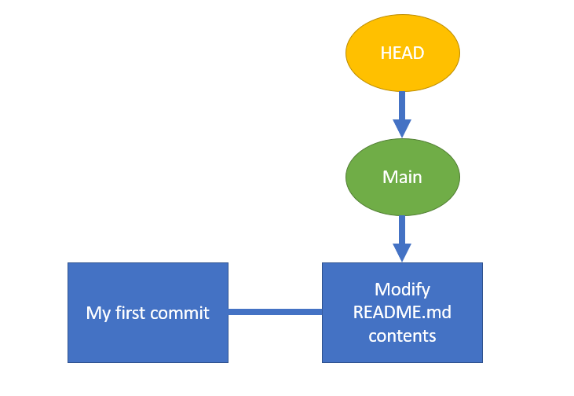
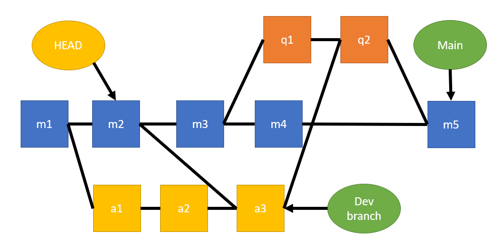
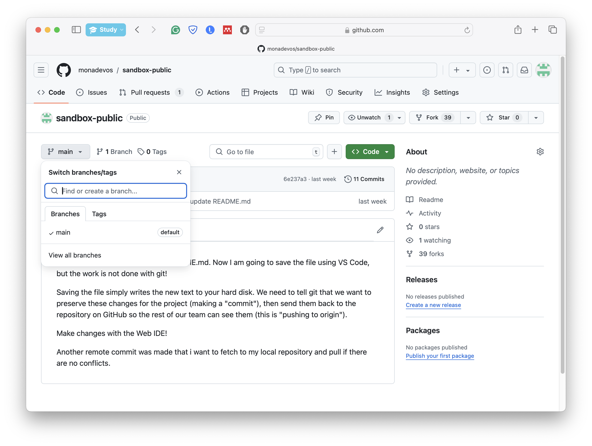
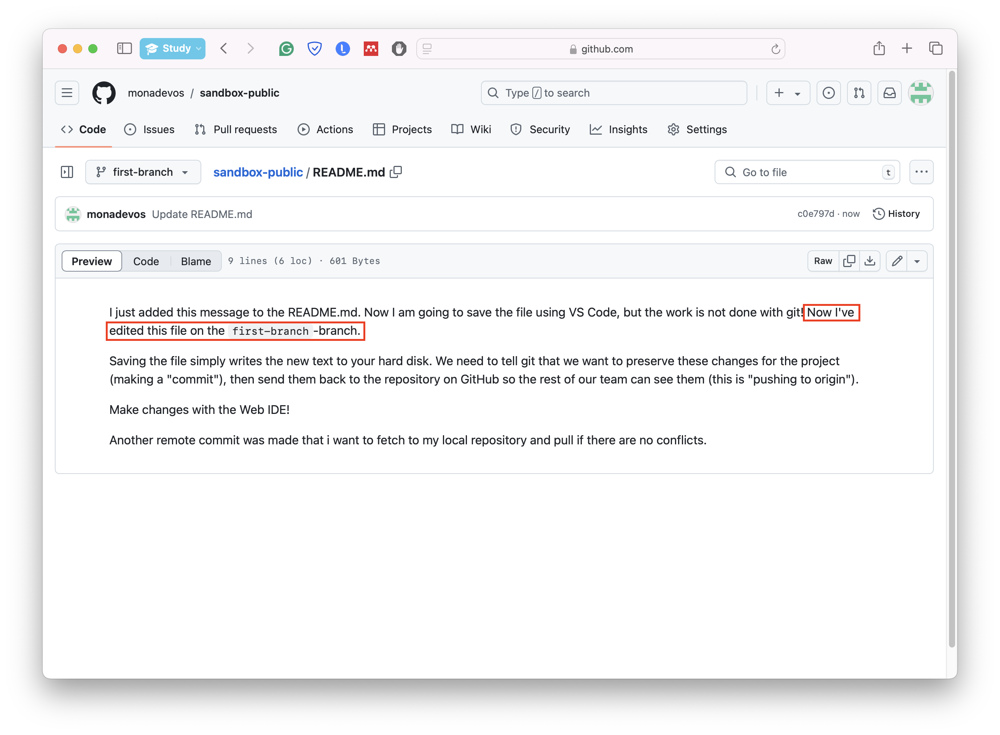
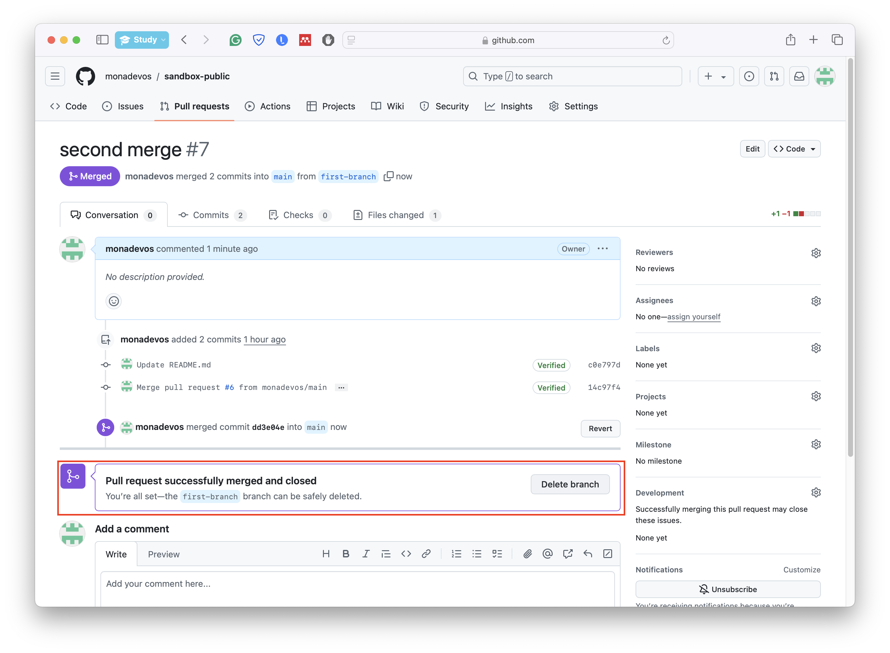

# Branching and merging

## What are branches

So far, we have only been making commits using the `main` or `master` branch, however, in practice, you will work on a separate branch, whose progress you will later merge with `main`.

Commits in git have a graph structure, where every node is a commit and edges represent the transition (flow) between commits. Branches can be thought of as pointers to commits, whereas HEAD points to the current commit that we are at. When you switch between branches, you can think of HEAD as the most recent commit on that branch.

The graph below shows the commit history of a repo with two commits:



The main advantage of version control is that it allows developers to work together in parallel. During projects, you will be working on "feature" branches and separating the work to review and merge it later. A common graphical structure of commits is shown below, where we have developers working on 3 separate branches and merging their work when necessary. This separation offers flexibility, parallelization of work, and offers more control over the development process.



## Creating a branch

First, let us check on what branch we are currently at. On GitHub, navigate to your repository and click on the "Branch: main" dropdown to see the list of branches. The branch with a checkmark is your current branch.



Let us create a new branch from `main` on GitHub, which we will call `first-branch`. Click on the "Branch: main" dropdown, type `first-branch` in the text box, and click "Create branch: first-branch".

We can move to the newly created branch by selecting it from the branch dropdown.


Let us modify our `README.md` file again and add a sentence to the first line of it. Navigate to the `README.md` file, click the pencil icon to edit it, and add your content to the first line:

```
Now I've edited this file on the `first-branch`-branch.
```

We will commit the new changes by filling out the commit message and clicking "Commit changes".



## Merging branches / pull requests

Note that when we switch to `main`, the `README.md` file does not contain the changes we made on the other branch.

Before merging our progress from `first-branch`, it is advisable to merge `main` into it first. This is done because we regard the `main` branch as the "face" of our project. When somebody is looking at our repository, they are likely to check the things on `main` first. Moreover, if there are any bugs from merging, it is better to resolve them on our separate branch. Sometimes it happens that after merging your progress to the `main` branch, the code on the `main` branch is no longer working correctly.

Therefore, we will first go back to our branch `first-branch`. Note that the edit we made is no longer visible. Let's add a commit here too to `README.md` at the last line:

```
And now I've edited this file on the `main`-branch.
```

We can merge the `main` branch into `first-branch` by creating a pull request. On GitHub, go to the "Pull requests" tab, click "New pull request", select `main` as the base branch and `first-branch` as the compare branch, and click "Create pull request".

We can now inspect the graph again with the new changes. The progress of the other branch (`main`) has been moved to `first-branch` as seen below.


We will now return to `main` and merge `first-branch` into it with another pull request. Follow the same steps as before, but this time select `first-branch` as the compare branch and `main` as the base branch.


## Deleting branches

Branch `first-branch` has lived its use, so we can delete it as we do not plan on making new changes to it. This will not remove any of the commits made on it. It will only remove the pointer itself. Do this from the pull request page by clicking "Delete branch".



## Branches locally

All of the above operations can also be performed locally using a Git client like VS Code. Here are the basics:

1. Check Current Branch: Open the source control panel in VS Code to see the current branch.
2. Create a New Branch: Use the branch icon in the status bar or the command palette (`Ctrl+Shift+P`) and select `Git: Create Branch`.
3. Switch Branches: Click on the branch name in the status bar and select the branch you want to switch to.
4. Make Changes and Commit: Edit your files, then use the source control panel to stage and commit your changes.
5. Merge Branches: Use the command palette to select `Git: Merge Branch` and choose the branch to merge from.
6. Delete Branches: Use the command palette to select `Git: Delete Branch` and choose the branch to delete.

## Collaborating with branches

When working together on a branch, it is important to coordinate with your team to avoid conflicts and ensure smooth collaboration. Here are some best practices:

- Keep in touch with your team about who is working on what.
- Frequently pull the latest changes from the remote branch to keep your local branch up to date. This helps in minimizing conflicts.
- Make small, frequent commits with clear messages. This makes it easier to track changes and resolve conflicts.
- Before merging changes, review pull requests carefully. Use GitHub's review features to comment on specific lines and suggest improvements.
- If conflicts arise, communicate with your team to resolve them.