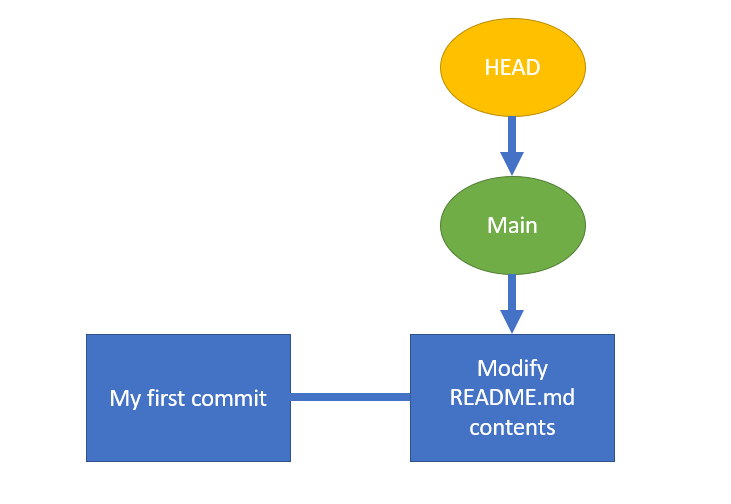
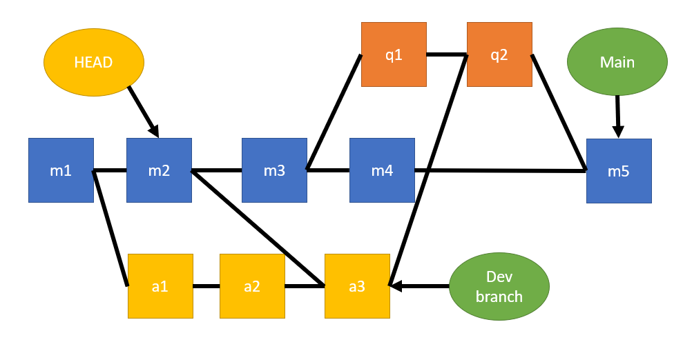
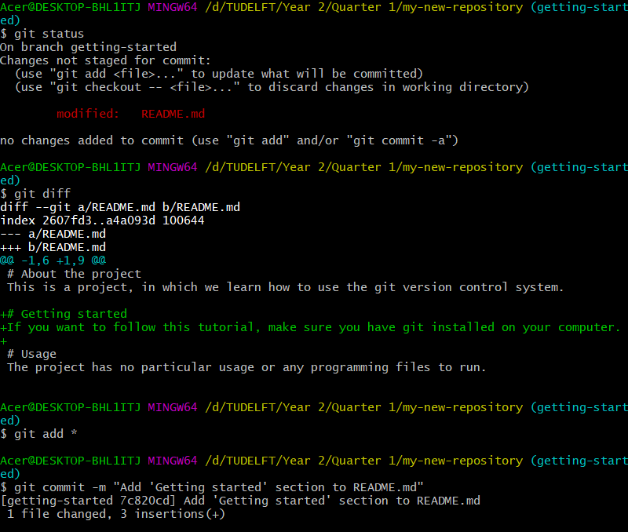
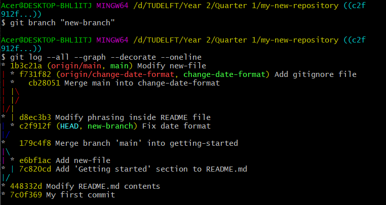

# Branching and merging

```{note}
This page was not shared with MUDE students in 2023-2024 (year 2).

It may have been a new page, or a modified page from year 1.

There may be pages in year 1 and year 2 that are nearly identical, or have significant modifications. Modifications usually were to reformat the notebooks to fit in a jupyter book framework better.
```

## What are branches


So far, we have only been making commits using the `main` branch,
however, in practice, you will work on a separate branch, whose progress
you will later merge with `main`.

Commits in git have graph structure, where every node is a commit and
edges represent the transition (flow) between commits. Branches can be
thought of as pointers to commits, whereas HEAD (something you saw when
we called `git log`) points to the current commit that we are at. When
you switch between branches, you can think of HEAD as the most recent
commit on that branch. For example, the most recent commit on branch
`main` is "Modify README.md contents".

The graph below displays the current commit history we have.



The main advantage of version control is that it allows developers to
work together in parallel. During projects you will be working on
"feature" branches and separating the work to review and merge it later.
A common graphical structure of commits is shown below, where we have
developers working on 3 separate branches and merging their work when
necessary. This separation offers flexibility, parallelization of work
and offers more control over the development process.



## Creating a branch


First let us check on what branch we are currently at. Call the command
`git branch`. The green text shows what branch we are currently
at.


Remember how at the beginning of this tutorial we created branch main
and checked-out to it? Let us create a new branch from main, which we
will call getting-started. Call the command git branch
"getting-started".

We can move to the newly created branch via
`git checkout getting-started`. Call `git branch` again to verify that
you have moved to a new branch.


Let us modify our README.md file again and add a '\"Getting started\"
section to it:

``` {columns="fullflexible" frame="single"}
# About the project
This is a project, in which we learn how to use the git version control system.

# Getting started
If you want to follow this tutorial, make sure you have git installed on your computer.

# Usage
The project has no particular usage or any programming files to run.

# Contributors
Kiril Vasilev - k.v.vasilev-1@student.tudelft.nl

Last modification: 30.04.2022
```

We will commit the new changes.



Note: if you use `git add *`, you can stage all tracked files
simultaneously. Be careful that you do not stage more files than you
wish to!

## Merging branches


To show how to merge branches, let us return to our main branch and
create a new empty file called "new-file.txt". Next, we will create a
new commit for it and return to `getting-started` branch .

Note that when we switch to `main`, the README.md file does not contain
the changes we made on the other branch.

Furthermore, the command `notepad new-file.txt` may not work for you if
you are using Linux or MacOS. Instead of executing this command, open
any texteditor application and create an empty file with the name
`new-file.txt`.


We now have a commit, which is ahead of the branch `getting-started`.
Call the following command to visualize the current repository graph
(figure {numref}`branch7`):

```
git log --all --graph --decorate --oneline
```


Before merging our progress from `getting-started`, it is advisable to
merge `main` into it first. This is done because we regard `main` branch
as the "face" of our project. When somebody is looking at our
repository, they are likely to check the things on `main` first.
Moreover, if there are any bugs from merging, it is better to resolve
them on our separate branch. Sometimes it happens that after merging
your progress to `main` branch, the code on `main` branch is no longer
working correctly.

Therefore, we will first checkout to `getting-started`. Note that the
new file we made is no longer visible. We can merge the branch main into
`getting-started` by calling the command `git merge main`. As a result,
we can get all the progress from that branch to `getting-started`. Upon
merging, this will open a text editor (vim is shown in {numref}`branch8`), through which
you can edit your commit message.

Press i to enter "insert mode" and change the message. Press ESC to exit
"insert mode". Finally, press `:x` to exit the vim environment. You may
find those steps a bit difficult, so we recommend that you press `:` and
then `x` to finish immediately the merge without changing the message.
In case you get stuck, follow the guide in the following link:
[https://phoenixnap.com/kb/how-to-exit-vim]( https://phoenixnap.com/kb/how-to-exit-vim)


We can now inspect the graph again with the new changes. The progress of
the other branch (`main`) has been moved to `getting-started` as seen below.


We will now return to `main` and merge `getting-started` into it:


Note that this time we are not prompted to enter a commit message for
our merge. Since git is a version control system and sees that there are
no new changes, it will simply move the pointer of branch `main` to the
same commit the branch `getting-started` points:


## Deleting branches


Branch `getting-started` has lived its use, so we can delete it as we do
not plan on making new changes to it. This will not remove any of the
commits made on it. It will only remove the pointer itself. Use
`git branch -d getting-started` to delete the branch.


## Creating a branch from an arbitrary commit (Optional) 


It is also possible to branch out from a past commit. This can be done
by checking out to existing commit . This
operation will create a so called "detached" HEAD. Here we checkout on
commit with id `c2f912f`. Note that the id will be different on your
machine. Therefore, replace this id with the id of the commit on your
machine, which relates to "Fix date format" commit.


Next, we can create a new branch from there. Alternatively, one can also
follow the instructions provided by git in figure
{numref}`branch13`.



In figure ,
you can now see that we have successfully created a new branch from the
current commit. We will discuss in the coming sections of this document
what the text in red and green mean, so do not be surprised that you are
seeing this now.
