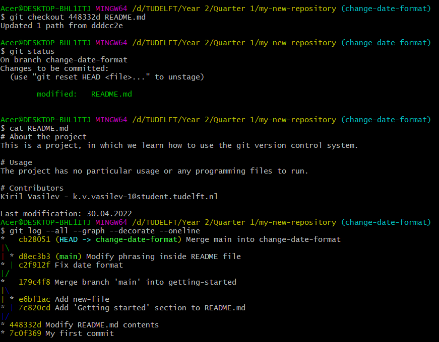
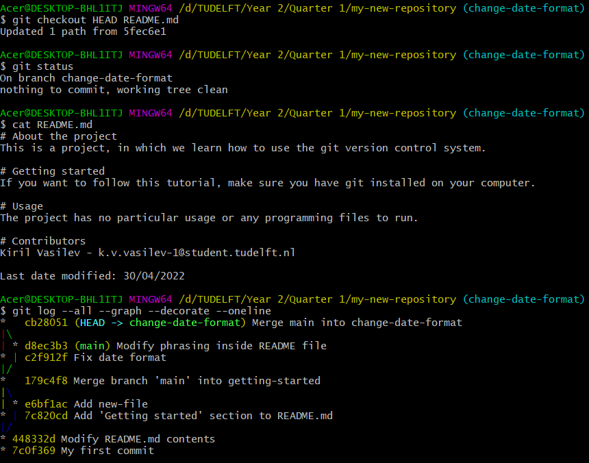
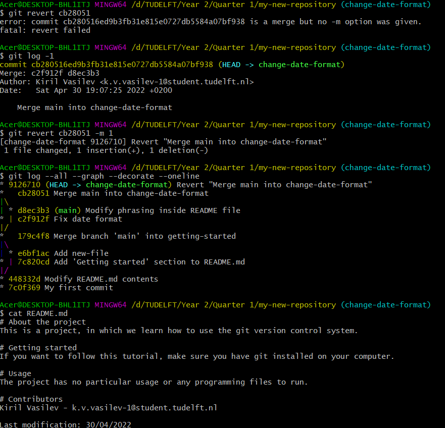
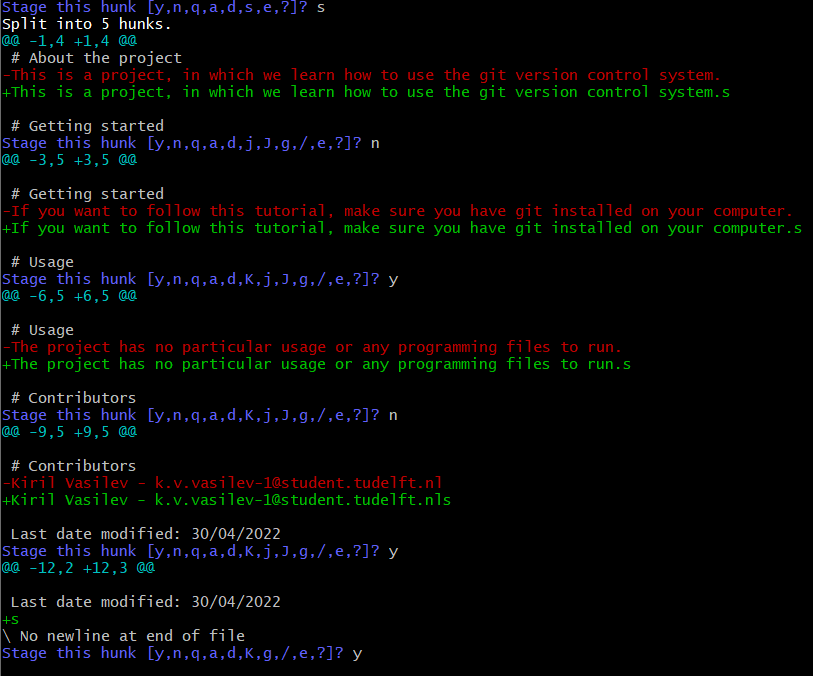
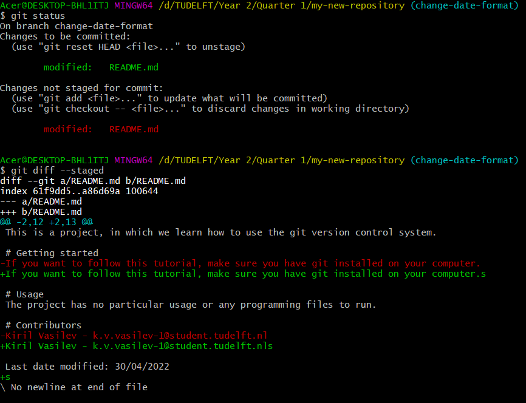

# The Rest of the 2022-23 Workshop

```{note}
This page was not shared with MUDE students in 2023-2024 (year 2).

It may have been a new page, or a modified page from year 1.

There may be pages in year 1 and year 2 that are nearly identical, or have significant modifications. Modifications usually were to reformat the notebooks to fit in a jupyter book framework better.
```

<!-- This git tutorial was originally modified from Kiril and Riccardo's version from 2022-23. It was converted from LaTeX to md with Pandoc. Original PDF is included for reference. -->


# Tracking changes

## Git log


We have previously mentioned the command `git log`, which gives a list
of all commits ({numref}`track1`).


## Git checkout -- recover old versions of a file (Optional) 


Suppose that we are unhappy with our changes on README.md and wish to
return to a previous version, namely the one in commit 448332d. We could
use the following format to achieve this:

    git checkout 448332d README.md



Notice in {numref}`track2` that because we included file name in the checkout command we have
returned to a previous version of the file, however, we have not moved
in the commit timeline, and we remain on our previous position in the
graph.

Notice that the file has new changes which are already included in the
repository as a staged commit (to see the changes use
`git diff --cached`). These changes thus appear as 'new' changes but are
in fact based on the older version of the same file. If we want to keep
this version, we can simply make a commit.

## Git checkout -- cancelling staged and unstaged changes (Optional) 


Suppose that we no longer deem them necessary and wish to cancel all of
them for README.md file. We can run the following command to delete our
changes and restore the file contents to its most recent commit -- the
commit HEAD points to:

```
git checkout HEAD README.md
```



As previously mentioned, we do not move in the commit timeline since we
have neither staged our changes nor moved in branches ({numref}`track3`).

## Git blame (Optional) 


Another way to track who modified a specific file is via the command
`git blame <file>`, where in `<file>` you put the file name and
extension that you want to check. This way, you will get line-by-line
information of who modified the line last, when and in which commit
(figure {numref}`track4`).


# Reverting changes

While working you may also end up in a situation where you make some
changes and commit them, but you are no longer satisfied with them and
wish to revert them. Here we will present a different command than the
one used in .

This can be done via the following command, where `<commit_id>` should
be the id of the commit's changes, you wish to revert:

    git revert <commit_id>

Pay attention to the fact that reverting commits that constitute a merge
is more difficult than reverting normal commits, because it is necessary
to add more arguments to the command above: you need to specify when
reverting to the changes, to which parent commit you wish to revert.
This situation is shown in the image [44](#revert1){reference-type="ref"
reference="revert1"}.



When executing the `git log` command with argument -1, we can get the
most recent commit. Since that commit is a merge commit, it has 2 parent
commits: `c2f912f` and `d8ec3b3`. Therefore, we can choose to which
parent commit to revert to by passing an argument -`m 1` to the
`git revert` command (we decided to revert to the first commit
`c2f912f`).

When typing the command above a text editor window will open to modify
the commit message. If you wish to make no changes to the message, just
write `:x` to close it (figure [45](#revert2){reference-type="ref"
reference="revert2"}).


Since git is a version control system, when reverting changes, we are
making a new commit for that. Run the command for graph visualization to
verify this.

# Resetting changes/branches

Reverting changes does not alter the timeline of previous commits on a
particular branch --- it simply creates a new commit. Resetting, on the
other hand, does alter the timeline. Resetting commits requires extra
care as you have the power to reset the entire repository and the power
to alter the commit history without leaving a clear record of what the
changes were.

`git reset` command comes with 3 types of arguments that you can pass to
it:

`--soft` -- equivalent to uncommiting the changes. This way the changes
to the file(s) will not be deleted and will remain staged. Hence,
running `git commit` afterwards can let us commit all the changes
immediately (and thereby undoing the soft reset if we made no additional
changes).

`--mixed` -- equivalent to uncommiting and unstaging the changes.
Therefore, contrary to `--soft`, we need to first stage changes and then
commit them (if we wish).

`--hard` -- equivalent to uncommiting, unstaging and deleting all
changes. This is the most dangerous of the 3 options as it can
completely alter the commit history and leaves no record of previous
changes to the file(s).

In order to show its power, we will reset the revert we did in the
previous section and leave no trace of it happening. Note that we also
pass as an argument the commit we are resetting to (figure
{numref}`revert3`).


# Stashing changes (Optional) 

Suppose you are working on something which is not ready yet and a friend
of yours asks to check his branch and what he has done there. However,
if you switch branches, you will either carry over your changes or cause
a conflict and git will not allow the checkout. In this situation, it is
best to stash your changes, that is save them without staging or
committing them, and return to them later.

This is possible using the command `git stash save <name>`, where
`<name>` depicts the name, you give to your stashed changes. Let us make
some changes to our README.md file and stash them. Note that when you
stash your changes, you remove them and store them for later use (figure
{numref}`stash1`).


We can use the command `git stash list` to get a list of all stashes.
Notice that every stash is associated with an id next to it, which is
modified every time we save or pop a stash.

We will make a few more changes to the file and stash them again. The
list of stashes will grow as a result as seen in figure
{numref}`stash2`.


We can now safely move to other branches and when ready return to the
current one and unstash the changes. This is possible via this command:
`git stash pop <index>`, where `<index>` is the index of the stash we
want to unstash. We have decided to unstash changes on index 1. Popping
the stash will effectively remove it from the list of stashes (figure
{numref}`stash3`).


We may also choose to delete a stash without using it. Using the
following command to achieve this: `git stash drop <index>` (figure
{numref}``).


# GitIgnore

Sometimes it happens that you wish to have some files in your repository
that you do not want to share with others (do not want to ever commit
and stage). For example, database-related files or some cache files left
by the applications you are using to develop your projects. The best way
to ignore those files is to instruct git to ignore them for you. Hence,
if git knows that it should ignore a given file, it will no longer
suggest you to stage/commit changes to that file.

Another example of files you should not commit are the `.DS_Store`
files, which are only generated on MacOS platforms.

Suppose we want to ignore all files of type png. Suppose that we also
wish to ignore a folder and all its contents called data, which we will
create now. In order to do so, we need to create a new file called
.gitgnore. Notice that the file has no name and has extension gitignore
(normally we can use `ls` to list files ({numref}`ignore1`), but since
those beginning with a '.' are generally hidden we pass the argument --a
to list all files - {numref}`ignore2`).


To instruct git to ignore that file and everything inside that folder,
we must modify the contents of our gitignore file to contain the
following (where '/' indicates all files in the directory 'data' and the
'\*' symbol is a wildcard to ignore all files with extension '.png').
Note that you can open the gitignore file as a normal text file to
modify it (using a text editor app) ({numref}`ignore3`).

```
data/
*.png
```


We would first need to commit our gitignore file to come into effect and
ignore files and directories (figure [54](#ignore4){reference-type="ref"
reference="ignore4"}).


The changes are no longer tracked (the images and files in the data
folder cannot be staged). This can be verified by using `git status`
({numref}`ignore5`).


Another advantage you get is that git will not let you stage a file,
which you have specifically set to be ignored by git ({numref}`ignore6`).


Depending on the projects you work on, there already exist pre-made
templates for gitignore files that you can make use of. Just make sure
that you pick a gitignore file that matches the language you are working
on and/or the IDE (integrated development environment) you are using.

# Interactive commits (Optional) 

So far when we wish to commit changes to a file, we were only able to
commit all of them. However, sometimes, we may wish to commit only some
of the changes. This can be done by passing an argument --p to your
`git add` command ({numref}`interactive1`).


You will get an overview of all the changes in your file and git will
ask you at every step what you wish to do. Use `?`({numref}`interactive2`) to get an explanation of what each option does. A hunk denotes a block of
changes (such as the one in the image above). Git allows you to split
the hunk into smaller hunks until a hunk becomes as small as 1 change.


We have decided to split the hunk into smaller hunks and stage only the
second, fourth and fifth hunks and leave out the first and third (figure
{numref}`interactive3`).



We can verify that we have successfully achieved this by calling
`git diff --staged` to compare the HEAD with the staged files -- only
second, fourth and fifth changes were staged (figure
{numref}`interactive4`).



Of course, since those changes contain mistakes (extra s at the end of 3
sentences), we can reset them. We use the `--mixed` argument to unstage
the changes, but not delete them ({numref}`interactive5`).


You can also commit part of the staged changes (the same way as we did
with staging only selected lines) by passing the --p parameter to
`git commit` command.

# Common mistakes using Git

While working you may end up making one of the following mistakes, so
make sure you double check you are executing the correct commands and
that you know what you wish to do:

-   Merging from the wrong branch

-   Committing on the wrong branch

-   Resetting more than you wanted

-   Committing the wrong file or changes

-   Giving a wrong branch name

-   Writing a commit message with a mistake in it

-   Deleting the wrong branch

-   Et cetera.


# GitLab videos

On top of this tutorial, there are 2 videos, which show the Basics and
Advanced parts (optional) of using GitLab.

-   GitLab basics: <https://youtu.be/H23G1582d1o>

-   GitLab Advanced (optional): <https://youtu.be/B7syxptEnZ0>. Note
    that in the advanced part of the GitLab tutorial, we present how
    Merge Requests are made and handled. The steps to achieve this are
    very similar to the steps you took during the PEP8 peer-review
    assignment.

# Aliasing commands (Optional)

This section of the workshop is optional.

You may be feeling fed up with writing this long command to visualize
the commit graph. This can easily be fixed by introducing an alias for
it. Namely, you can set up an alias called graph for it. Hence, you can
replace the long command with a shorter one called git graph:

```
git config --global alias.graph "log --all --graph --decorate --oneline" 
```

Try using `git graph` afterwards to verify it worked ({numref}`alias1`).


If you wish to remove an alias, simply execute the following:

```
git config --global --unset alias.graph 
```


# Conclusion 


At first glance, Git has a steep learning curve and requires a lot of
knowledge and time to spend learning and practicing. However, knowing
how to use Git will pay off in the future! We hope that you found this
tutorial useful. Make sure you return to it occasionally when you are in
doubt about something. Remember that you can always Google things to
learn more. What is more, this tutorial is not exhaustive, but covers
the required basics of Git, which should be sufficient for you to work
in group projects.

Finally, in case something goes wrong, remember to follow the
instructions in {numref}`conclusion` ;)


# References and used resources

While creating this tutorial, we made use of the following external
sources:

-   <http://swcarpentry.github.io/git-novice/>

-   <https://coderefinery.github.io/git-intro/>

-   <https://coderefinery.github.io/github-without-command-line/>

-   <https://coderefinery.github.io/git-collaborative/>

# Appendices

In the appendices you can find commonly used Git and Bash commands. You
may notice that we surround some of them with quotations (") . These are
only necessary when the argument you are passing on contains
whitespaces. For example, this is usually the case in commit messages.
However, if you have no spaces in your arguments, you can omit the
quotations.

## Appendix A: Commonly used Git commands 


Table with commonly used Git commands:

  **Explanation of git command**                                      **Git command**                            **Example**
  ------------------------------------------------------------------- ------------------------------------------ ---------------------------------------------------------------
  Initialise repository                                               git init                                   git init
  Add files to the staging area                                       git add                                    git add "README.md"
  Commit changes                                                      git commit                                 git commit --m "Add README.md file"
  Merge the changes from one branch to another                        git merge                                  git merge "development"
  Get a list of all commits                                           git log                                    git log
  Get an overview of who was the last one to modify lines in a file   git blame                                  git blame README.md
  Show difference between commits (and/or files)                      git diff                                   git diff 1234567 7654321
  Create a branch                                                     git branch                                 git branch feature1
  Move to another branch                                              git checkout                               git checkout feature1
  Revert a commit                                                     git revert                                 git revert 1234567
  Store changes (without committing or staging)                       git stash                                  git stash save "my-stash"
  Uncommit and unstage changes on a branch                            git reset --mixed                          git reset --mixed development
  Push changes to a remote repository                                 git push                                   git push
  Fetch and merge changes from a remote repository                    git pull                                   git pull
  Fetch changes from a remote repository                              git fetch                                  git fetch
  Clone a remote repository                                           git clone                                  git clone git@gitlab.ewi.tudelft/myrepository.git
  Associate current repository with remote one                        git remote                                 git remote add origin git@gitlab.ewi.tudelft/myrepository.git
  List staged/unstaged/untracked files                                git status                                 git status
  Set email used for commits                                          git config --global user.email \<email\>   git config --global user.email myemail@tudelft.nl
  Recover old versions of a file                                      git checkout                               git checkout 1234567 README.md

## Appendix B: Commonly used bash commands 


Table with commonly used bash commands:

  **Explanation of bash command**                                                                                                                                       **Bash command**   **Example**
  --------------------------------------------------------------------------------------------------------------------------------------------------------------------- ------------------ -----------------
  List files/folders in current directory including hidden ones                                                                                                         ls --a             ls -a
  Create an empty file                                                                                                                                                  touch              touch README.md
  Create an empty directory                                                                                                                                             mkdir              mkdir "util"
  Enter a folder inside a directory                                                                                                                                     cd                 cd util
  Leave a directory                                                                                                                                                     cd                 cd ../
  Remove a folder                                                                                                                                                       rmdir              rmdir util
  View the contents of a file                                                                                                                                           cat                cat README.md
  Clear the terminal contents                                                                                                                                           clear              clear
  Move a file or directory to a different location. Note that the first argument is location of folder/file to move and the second argument is the new location of it   mv                 mv /c/util /d/
