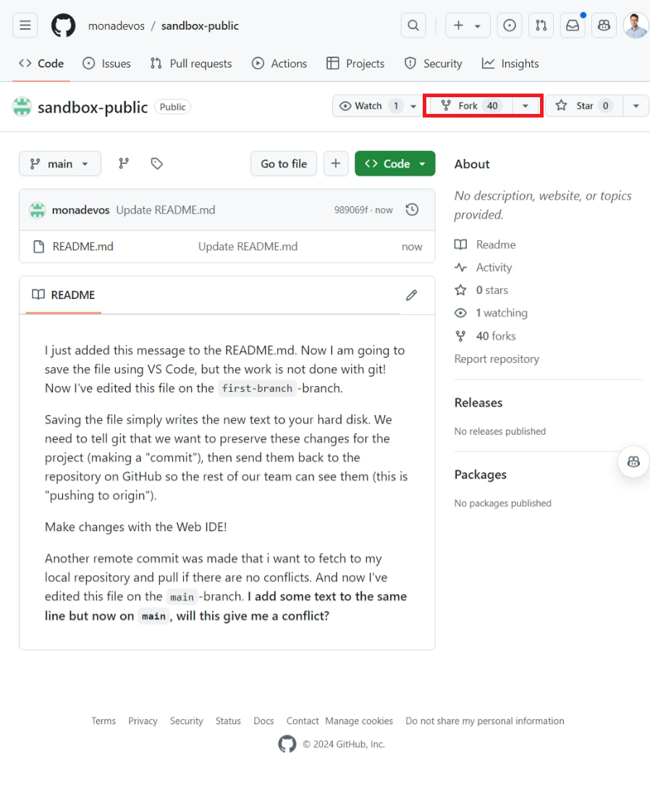

# Forking

## Forking a Repository

Forking a repository on GitHub allows you to create a personal copy of someone else's project. This is particularly useful when you want to contribute to a project but do not have write access to the original repository.

To fork a repository, follow these steps:

1. Navigate to the repository you want to fork on GitHub.
2. Click the "Fork" button at the top right of the repository page.

This will create a copy of the repository under your GitHub account. You can now clone this forked repository to your local machine and make changes as you would with any other repository.

## Contributing Back to the Original Repository

Once you have made changes to your forked repository, you can contribute back to the original repository by creating a pull request. The process is similar to merging branches within a repository:

1. Make some changes to your forked repository
2. Navigate to the original repository on GitHub.
3. Click the "New pull request" button.

4. Select the branch from your forked repository that contains your changes.
5. Provide a title and description for your pull request, then click "Create pull request".

The maintainers of the original repository will review your pull request. If they approve it, your changes will be merged into the original repository.

Forking and pull requests are powerful features of GitHub that enable collaborative development across different repositories, even when you do not have direct access to the original project.
