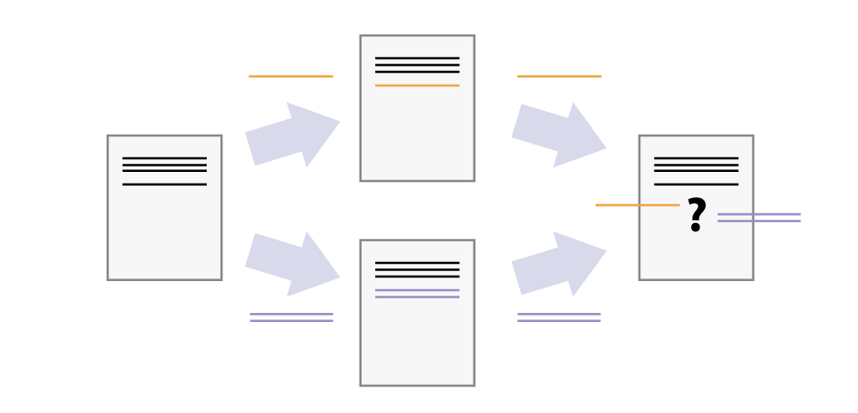
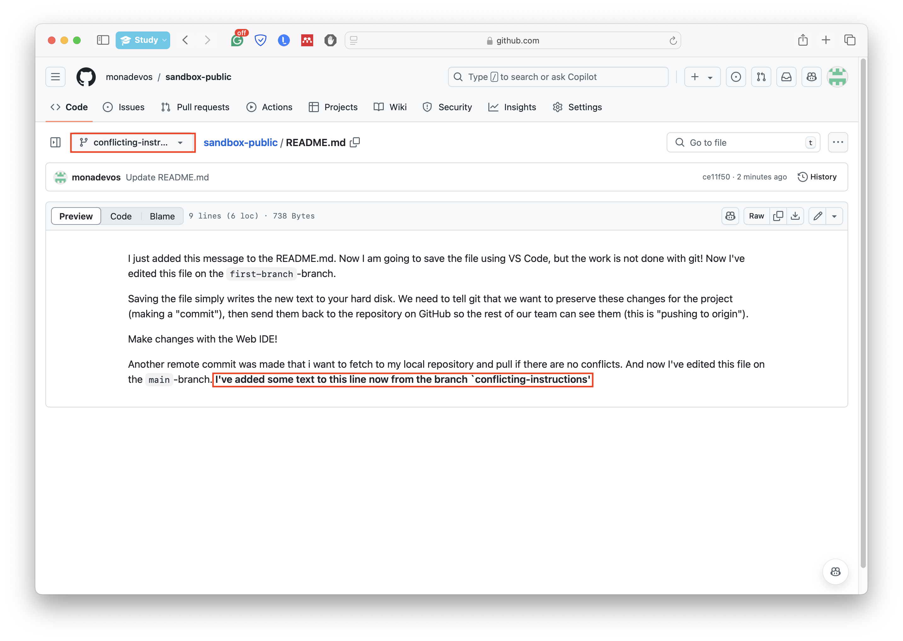
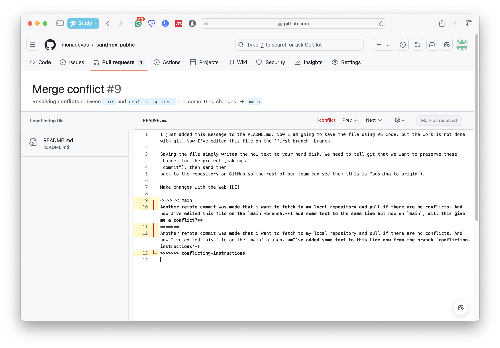
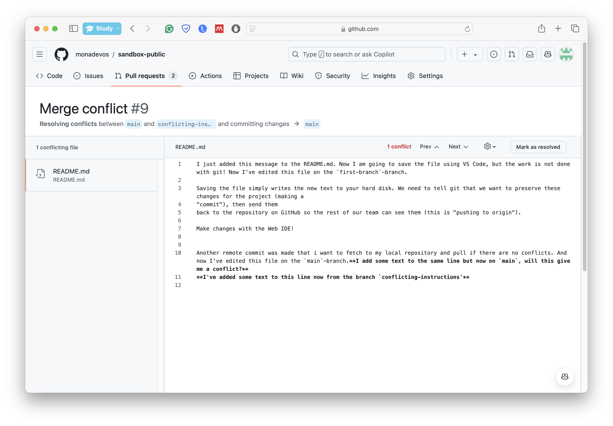
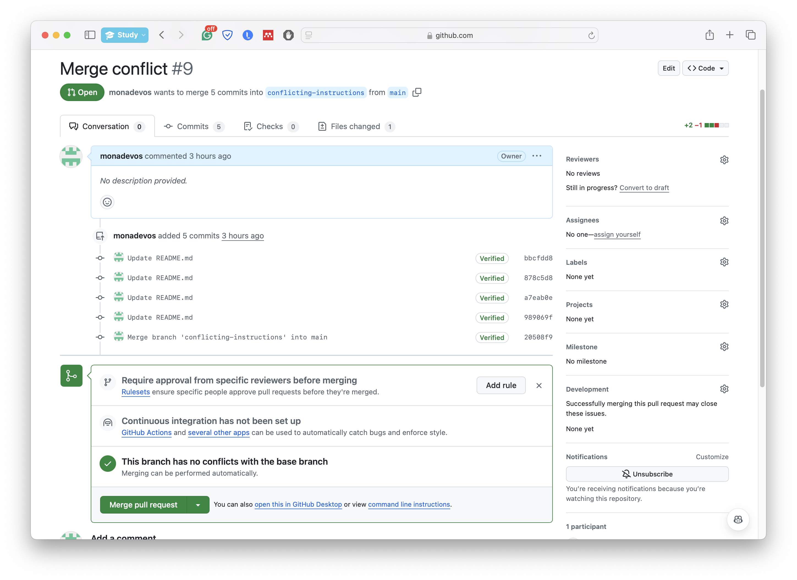

# Merge conflicts
Merge conflicts arise when people on separate branches modify the same parts of one (or multiple) files. Since Git does not know how to handle that and whose changes to consider, it prompts the user to decide instead.



Let us create a merge conflict ourselves:

We will start by making a new branch `conflicting-instructions` on GitHub. We will edit the `README.md` file on the last line

```
...

And now I've edited this file on the `main`-branch. **I've added some text to this line now from the branch `conflicting-instructions`**
```



Next, we will return to the `main` branch on GitHub. We will edit the same line of the markdown file with some other text:

```
...

And now I've edited this file on the `main`-branch. **I add some text to the same line but now on `main`, will this give me a conflict?**
```

Finally, we will attempt to merge the `main` branch into the `conflicting-instructions` branch using the pull request interface on GitHub. This will result in a merge conflict, as seen in the figure below, because we modified the same parts of the file.



The changes on the current branch are preceded by `<<<<<<< HEAD`, while the changes from the `main` branch are preceded by `=======` and followed by `>>>>>>> main`. To fix this conflict, we need to open the file in the GitHub editor and resolve the conflict by keeping the desired changes and removing the unnecessary parts. Once done, we can commit the resolved changes directly from the GitHub interface. Note that the current branch is now in a "MERGING" state. We have decided to take the best out of the two branches and merge their changes.




### Why Merge into the conflicting branch First?

Merging into the conflicting branch first allows you to resolve conflicts in a controlled environment. Here are some reasons why this approach is beneficial:

- By resolving conflicts in the feature or conflicting branch, you isolate the changes and ensure that the main branch remains stable and conflict-free.
- In case of coding, you can thoroughly test the merged changes in the conflicting branch before integrating them into the main branch, reducing the risk of introducing bugs.
- Keeping the main branch clean and conflict-free simplifies the integration process and makes it easier for other team members to continue their work without interruptions.