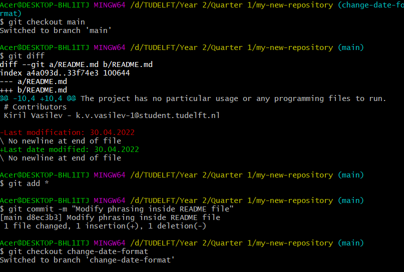

# Merge conflicts

Merge conflicts arise when people on separate branches modify the same
parts of one (or multiple) files. Since git does not know how to handle
that and whose changes to consider, it prompts the user to decide
instead ({numref}`mconflict1`).

Let us create a merge conflict ourselves:

We will start by making a new branch `change-date-format`. We will
checkout to it, modify the date format and make a commit as show in
figure {numref}`mconflict2`.

Next, we will return to `main` branch. We will edit the same line of the
README.md and then checkout back to `change-date-format` branch ({numref}`mconflict3`).

In figure {numref}`mconflict3`
there is also a graph visualization.

Finally, we will merge `main` into `change-date-format` and get a merge
conflict as seen in figure {numref}`mconflict5`}, because we modify the same parts of the file.

The changes on the current branch are preceded by \<\<\<\<\<\<\< HEAD,
while the changes from `main` branch are preceded by ======= and
followed by \>\>\>\>\>\>\>main. In order to fix this conflict, we need
to open the file README.md with some texteditor app and fix the conflict
ourselves. That is, edit out the things we do not need: open a text
editor and remove the parts of the file we do not need. When done, we
just need to make a new commit. Note that the current branch is now in
stage "MERGING". We have decided to take the best out of the 2 branches
and merge their changes.

Thus, we have succeeded in dealing with a merge conflict! The graph in
figure {numref}`mconflict6`
displays how the 2 branches have now been merged.